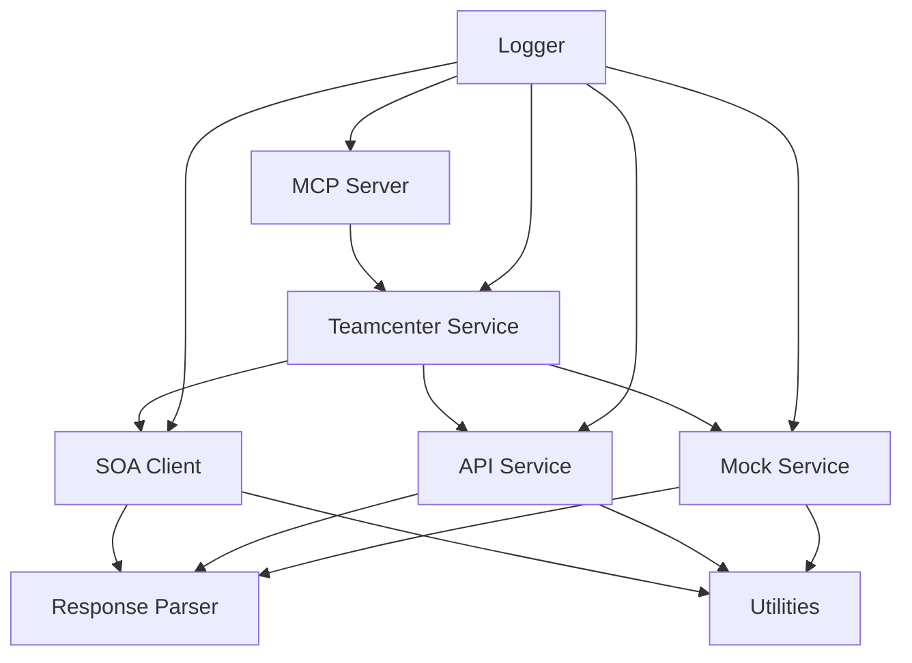

# System Patterns: Teamcenter MCP Server

## System Architecture

The Teamcenter MCP Server follows a layered architecture that separates concerns and promotes maintainability:

```
┌─────────────────────────────────────────────────────┐
│                  MCP Server Layer                   │
│  (Handles MCP protocol, resources, and tool calls)  │
├─────────────────────────────────────────────────────┤
│                 Service Layer                       │
│  (Business logic, Teamcenter operations)            │
├─────────────────────────────────────────────────────┤
│                 Client Layer                        │
│  (SOA client, API communication, authentication)    │
├─────────────────────────────────────────────────────┤
│                 Utility Layer                       │
│  (Response parsing, session management, utilities)  │
└─────────────────────────────────────────────────────┘
```

### Key Components

1. **MCP Server (index.ts)**
   - Implements the Model Context Protocol
   - Defines resources and tools
   - Handles request routing
   - Manages server lifecycle

2. **Teamcenter Service (teamcenterService.ts)**
   - Implements business logic for Teamcenter operations
   - Manages session state
   - Provides high-level API for Teamcenter operations

3. **SOA Client (tcSOAClient.ts)**
   - Handles communication with Teamcenter REST API
   - Manages authentication and session tokens
   - Formats requests according to Teamcenter API specifications

4. **API Service (tcApiService.ts)**
   - Alternative implementation for REST API communication
   - Used for specific API endpoints not covered by SOA

5. **Mock Service (tcMockService.ts)**
   - Provides mock implementations for testing
   - Simulates Teamcenter responses

6. **Response Parser (tcResponseParser.ts)**
   - Transforms Teamcenter API responses into standardized objects
   - Handles error cases and edge conditions

7. **Utilities (tcUtils.ts)**
   - Provides helper functions
   - Manages session storage and retrieval

## Key Technical Decisions

### 1. MCP Protocol Implementation

The server implements the Model Context Protocol (MCP) to expose Teamcenter functionality to Claude. This decision enables:

- Standardized communication between Claude and Teamcenter
- Clear separation between the UI (Claude) and the data source (Teamcenter)
- Ability to expose both resources (data) and tools (actions)
- Dynamic resource access through URI templates

### 2. Service-Oriented Architecture (SOA)

The server uses Teamcenter's SOA API for most operations, which provides:

- Comprehensive access to Teamcenter functionality
- Consistent error handling
- Support for complex operations
- Standardized request/response formats

### 3. Singleton Pattern for Services

The teamcenterService is implemented as a singleton to:

- Maintain a single session with Teamcenter
- Provide a consistent interface for Teamcenter operations
- Simplify state management
- Enable dynamic method creation for missing functionality

### 4. Environment-Based Configuration

Configuration is managed through environment variables to:

- Separate configuration from code
- Support different deployment environments
- Secure sensitive information like credentials
- Enable mock mode for testing without a real Teamcenter instance

### 5. Error Handling Strategy

The server implements a comprehensive error handling strategy:

- All API calls are wrapped in try/catch blocks
- Errors are transformed into standardized TCResponse objects
- MCP errors are mapped to appropriate error codes
- AppError class with error types for better categorization
- Detailed logging with request IDs for traceability

## Component Relationships



### Data Flow

1. **Request Flow**:
   - Claude sends an MCP request to the server
   - The server routes the request to the appropriate handler
   - The handler calls the teamcenterService
   - The service uses the SOA client to communicate with Teamcenter
   - The response is parsed and returned to Claude
   - Each request is assigned a unique ID for tracing

2. **Authentication Flow**:
   - The server reads credentials from environment variables
   - On startup, it authenticates with Teamcenter
   - The session token is stored for subsequent requests
   - Session cookies are managed for persistent authentication
   - If authentication fails, appropriate errors are returned

3. **Error Flow**:
   - API errors are caught and transformed into TCResponse objects
   - Errors are categorized by type (API_RESPONSE, DATA_PARSING, etc.)
   - MCP errors are mapped to appropriate error codes
   - Errors are logged with context information for debugging
   - User-friendly error messages are returned to Claude

## Design Patterns

### 1. Facade Pattern

The teamcenterService acts as a facade, providing a simplified interface to the complex Teamcenter API:

```typescript
// Simplified interface exposed by the facade
async searchItems(query: string, type?: string, limit?: number): Promise<TCResponse<TCObject[]>>

// Complex implementation details hidden behind the facade
const searchOptions: TCSearchOptions = {
  searchInput: {
    providerName: "Fnd0BaseProvider",
    searchCriteria: { Name: query },
    // ... many more configuration options
  }
};
```

### 2. Adapter Pattern

The response parser adapts Teamcenter's complex response format to a simplified TCObject format:

```typescript
// Adapter function
export function convertToTCObject(rawObject: any): TCObject {
  return {
    id: rawObject.uid,
    name: rawObject.properties.object_name?.dbValues?.[0] || '',
    // ... mapping between different formats
  };
}
```

### 3. Factory Pattern

The SOA client uses a factory function to create new instances:

```typescript
// Factory function
export function createSOAClient(config: TCSOAClientConfig, sessionId?: string | null): SOAClient {
  return new SOAClient(config, sessionId);
}
```

### 4. Strategy Pattern

The server can use different service implementations (API, SOA, Mock) based on configuration:

```typescript
// Different strategies for the same operation
// SOA strategy
teamcenterService.searchItems = async (query, type, limit) => {
  // Implementation using SOA
};

// Mock strategy
mockTeamcenterService.searchItems = async (query, type, limit) => {
  // Implementation using mock data
};
```

## Critical Implementation Paths

### 1. Authentication

```
MCP Server -> teamcenterService.login() -> SOAClient.callService() -> tcApiService.realCallService() -> Teamcenter API -> Session Token/Cookie -> tcUtils.storeSessionCookie()
```

### 2. Item Search

```
MCP Server -> teamcenterService.searchItems() -> SOAClient.callService() -> tcApiService.realCallService() -> Teamcenter API -> Raw Results -> tcResponseParser.parseJSONResponse() -> TCObjects
```

### 3. Item Creation

```
MCP Server -> teamcenterService.createItem() -> SOAClient.callService() -> tcApiService.realCallService() -> tcUtils.createJSONRequest() -> Teamcenter API -> Raw Result -> tcResponseParser.parseJSONResponse() -> TCObject
```

### 4. Resource Access

```
MCP Server -> ReadResourceRequestSchema handler -> URI pattern matching -> teamcenterService method -> SOAClient.callService() -> tcApiService.realCallService() -> Teamcenter API -> Raw Result -> JSON Response
```

## Performance Considerations

1. **Session Management**: 
   - The server maintains a single session with Teamcenter to reduce authentication overhead
   - Session cookies are stored for persistent authentication
   - Session state is managed to avoid unnecessary re-authentication

2. **Response Parsing**: 
   - Heavy parsing is done server-side to reduce the load on Claude
   - Standardized response formats for consistency
   - Selective attribute inflation to reduce response size

3. **Error Handling**:
   - Common errors are categorized by type for better handling
   - Detailed error context for easier troubleshooting
   - Request IDs for tracing requests through the system

4. **Request Optimization**:
   - Search results are paginated to manage large result sets efficiently
   - Result limits can be specified to control response size
   - Search filters can be applied to narrow results

5. **Timeout Handling**: 
   - API calls have configurable timeouts to prevent hanging operations
   - AbortController is used for request cancellation
   - Timeout errors are properly categorized and reported
